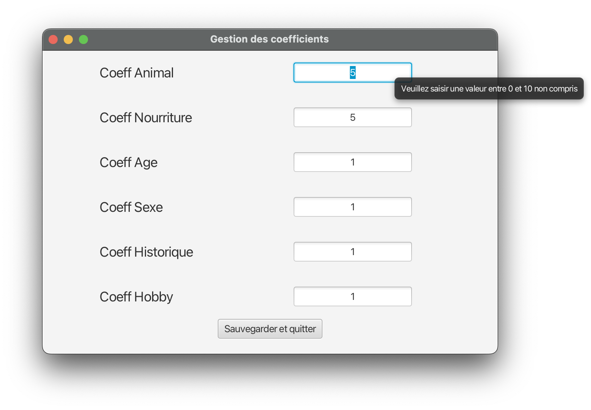

{.logo}
{.logo}


## Introduction

Dans le cadre de notre BUT Informatique, nous avons comme projet la création d'une application d'aide à la prise de décision lors d'échanges scolaires dans différents pays. Ce rapport se concentrera sur la partie *Interface Humain Machine*, où nous avons fait de notre mieux pour créer une interface graphique élégante, simple, et efficace.

Notre projet est disponible [sur notre page Gitlab](https://gitlab.univ-lille.fr/sae2.01-2.02/2023/D1).

*Référence du dernier commit :* [0c424aac2b8a6d50559e460d4e8cb83e655ab194](https://gitlab.univ-lille.fr/sae2.01-2.02/2023/D1/-/tree/0c424aac2b8a6d50559e460d4e8cb83e655ab194)

## Présentation de l'application

### Menu principal


Ici rien, de très compliqué : 3 simples boutons pour 3 actions différntes :

- Créer une nouvelle session. Cette fonctionnalité n'était pas demandé, mais nous avons néanmoins voulu laisser cette possibilité. Cela dirige l'utilisateur vers une fenêtre qui lui permet de sélectionner un ou plusieurs fichier(s) csv, afin d'ajouter des adolescents à l'application.
- Charger une précédente session. Ici, l'utilisateur pourra reprendre là où il en était en récupérant toutes les informations sur les adolescents, les échanges et affectations. Il est important de noter que ce bouton est désactivé dans le cas où une sauvegarde n'est pas présente.
- Quitter l'application.

### Création d'une nouvelle session


Ce sélecteur nous permet d'ajouter, un ou plusieurs fichiers à importer.
Pour éviter les erreurs inutiles, lorsque la liste est vide, il n'est pas possible de passer à l'étape suivante.

Quant à lui, le bouton "Annuler" permet de retourner à l'écran précédent, peu importe d'où cette fenêtre a été affiché.


Enfin, l'import des adolescents se déroule en arrière plan. Nous avons ajouté la possibilité d'afficher le détail de l'importation, pour connaitre les éventuelles erreurs. Par défaut, les détails sont masqués car ce n'est pas forcément digeste pour un utilisateur lambda.

### Gestion des échanges

Nous arrivons au coeur de notre application : gérer les différentes affectations entre adolescents de pays différents.


Premièrement, nous avons un menu dans la partie haute qui nous permet d'accéder à des paramètres, ou de gérer la liste des adolescents.

Ensuite, nous avons 2 listes déroulantes qui permettent de sélection un pays hôte et un pays visiteur. Les pays présents sont uniquement ceux pour lesquels il existe des adolescents. Aussi, nous avons accordé une attention toute particulière pour empêcher de sélectionner le même pays :

- Lors de la sélection du pays hôte, ce dernier est retiré de la liste des pays invités
- Lors du changement de pays hôte, ce dernier est ajouté à la liste des pays invités
- Si l'utilisateur modifie le pays hôte et sélectionne le pays qui est déjà sélectionné en tant qu'invité, il n'est plus présent en tant qu'invité.


Après la sélection des 2 pays, plusieurs choses évoluent :

- Les boutons Enregistrer et Affectation optimale deviennent actifs
- La liste des affectations est affichée
- Des cadenas apparaissent au dessus de la *Scrollpane* pour verrouiller ou déverrouiller toutes les affectations.

Cette fenêtre nous permet de répondre à l'ensemble du cahier des charges. Regardons chacun de ces points en détail.

#### Visualiser l'ensemble des appariements

Pour ce faire, nous avons une colonne qui regroupe l'ensemble des hôte, et une autre pour les invités. Aussi, nous avons des informations sur le nombre d'hôtes et invités qui ne sont actuellement pas affectés. Nous avons choisi de ne montrer le liste de ces adolescents uniquement lorsque l'on passe la souris sur le *"?"*, afin de ne pas alourdir l'affichage.

De plus, si un adolescents est déjà lié avec un autre, un message apparaît.

Aussi, un simple bouton suffit à générer les appariements optimaux.

#### Visualiser les détails sur un appariement

Pour éviter d'afficher trop d'informations, lorsque nous déplaçons la souris sur un appariement, une flèche apparaît et nous permet d'afficher tous les détails des deux étudiants : âge, genre, hobbies...

#### Visualiser les contraintes rédhibitoires

Pour ce faire, nous affichons à droite de chaque appariement la liste des contraintes non respectées en rouge, ou en vert si elles le sont. Nous avons choisi de garder ces informations visibles constamment car c'est un élément important à prendre en compte lors des affectations.

#### Fixer au préalable des affectations

Chaque ligne peut être verrouiller/libérer avec le cadenas qui apparaît lorsque la souris survole un appariement, et il est possible de faire cela pour tous les appariements en une seule fois. Dans ce dernier cas, une fenêtre permet de confirmer ce choix pour éviter les erreurs.

Lorsqu'un appariement est verrouillé, celui ci n'est pas pris en compte lors du calcul d'appariements optimaux.

#### Eviter d'affecter des adolescents

Cela est possible en ne sélectionnant pas d'invité, puis en verrouillant la ligne. De ce fait, l'adolescent hôte n'est affecté à aucun invité.


### Ajuster les pondérations des critères



Cette écran s'affiche en mode "popup" et permet de mettre à jour le poids de chaque critère. Il n'est pas possible de saisir une donnée incorrecte, et un message d'aide permet à l'utilisateur de savoir quoi saisir.

## Implémenation en JavaFX

Il s'agissait de notre première application en JavaFX, et nous estimons intéressant d'expliquer notre démarche pour implémenter cette interface graphique.

Premièrement, pour la création des fenêtres, nous avons utilisé [JavaFX Scene Builder](https://gluonhq.com/products/scene-builder/). Cela nous a permis de créer aisément les visuels, en les modifiants facilement.

Ici, la plus grande difficulté était de bien gérer la disposition, et de s'adapter à la taille de la fenêtre : Label qui s'agrandit automatiquement, figer certaines tailles...

Ensuite, pour la partie évènementielle, nous n'avons pas trouvé pertinent d'utiliser les fonctionnalité de *JavaFX Scene Builder*. En effet, nous n'avons pas assez de contrôle, puis cela rend difficile de modifier le code.

Pour pallier à cela nous avons créer plusieurs classes :


La classe abstraite *Controller* définit ce qu'est un contrôleur : Un chemin vers un fichier fxml, un élément de type `Parent` qui définit l'élément JavaFX parent de la scene correspondante, puis une méthode initialize() qui doit forcément être définit : elle est exécuté lors de l'import d'un fichier fxml.

Ensuite, nous avons deux sous définitions de contrôleurs : un contrôleur de scene, qui gère une scène complète (donc une fenêtre avec un élément de type `Stage`). Puis, un contrôleur d'élément qui gère les éléments complexes qui sont rajoutés à une scene. Par exemple, une ligne d'affectation de notre application qui nécessite des méthodes qui lui sont propres.

Cette gestion nous facilite grandement la gestion des évènements et nous permet d'éviter la redondance de code : Ce sont les méthodes `updateStage` et `loadElement` qui s'occupe d'importer le fichier fxml.

### Un exemple

Pour illustrer cela, nous pouvons nous concentrer sur le menu principal :
```Java
public class MainMenuController extends SceneController {

	public MainMenuController(Stage stage) {
		super(FXMLScene.MAIN_MENU.getPath(), FXMLScene.MAIN_MENU.getTitle(), stage);
		this.updateStage();
	}
```

Ici, ce contrôleur met à jour l'élément `stage` qui lui a été donné en paramètre. en précisant le chemin vers le fichier .xml à utiliser.

Enfin, nous définissons la méthode `initialize()` pour ajouter la gestion des évènements :

```Java
public void initialize() {
		//Go to importation scene
		this.newSessionButton.addEventHandler(ActionEvent.ACTION, a -> {
			SceneController controller = new FileSelectorController(this.stage, this);
			controller.getStage().show();
		});
		//load existing session
		if (new File(voyages.Platform.SAVE_PATH).exists()) {
      ...
				SceneController controller = new AffectationController(this.stage, platform);
				controller.getStage().show();
			});
		}
		//Exit the app
		this.quitButton.addEventHandler(ActionEvent.ACTION, a -> {
			Platform.exit();
			System.exit(0);
		});
	}
```

Nous pouvons voir que le changement de fenêtre se fait uniquement en créeant un objet de type `SceneController`.

## Contributions de chaque membres du groupe

Pour ce projet d'interface graphique, nous pouvons le découper en 3 phases :

- Maquettage basse qualité
- Maquettage haute qualité
- Implémentation réelle

Pour les différentes étapes de maquettage, nous avons tous collaboré ensemble, en donnant tous des idées, en itérant...

Cependant, l'implémentation réelle a été réalisé en très grande partie par une seule personne, avec de l'aide des autres membres de façon poncutelle.

Nous avons opté pour cette organisation car nous avions beaucoup d'autres choses à réaliser : Une partie graphe avec rapport et développement, mais aussi développement d'une version en ligne de commande.
Le fait que chacun s'occupe d'une seule partie nous a permis d'être plus efficace, car chacun maîtrisait ce qu'il avait à faire.
